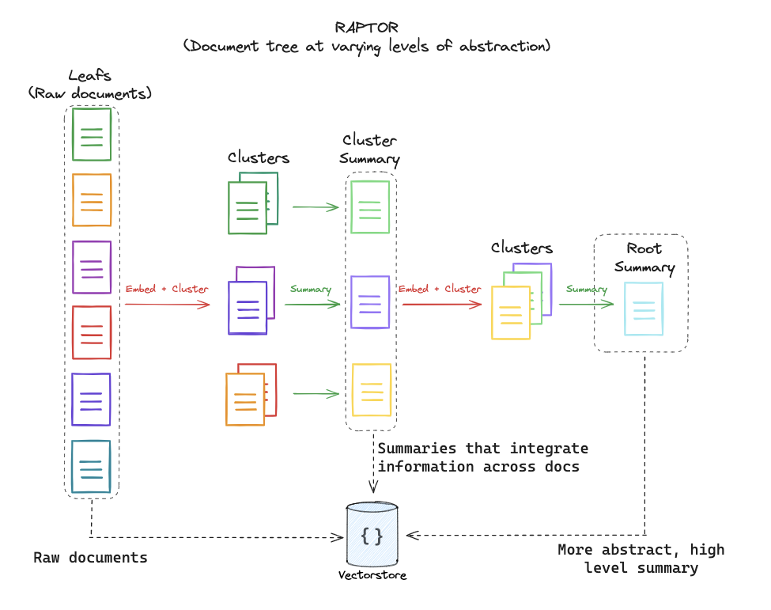

# Advanced-RAG

- data source (꺼무위키): 
    1. [프랑키 문서](https://namu.wiki/w/%ED%94%84%EB%9E%91%ED%82%A4)
    2. [톰 문서](https://namu.wiki/w/%ED%86%B0(%EC%9B%90%ED%94%BC%EC%8A%A4))
    3. [사우전드 써니 호](https://namu.wiki/w/%EC%82%AC%EC%9A%B0%EC%A0%84%EB%93%9C%20%EC%8D%A8%EB%8B%88%20%ED%98%B8?from=%EC%82%AC%EC%9A%B0%EC%A0%84%EB%93%9C%20%EC%8D%A8%EB%8B%88%ED%98%B8)

- `data/doc1`: `rag-chroma1` -> 1
- `data/doc4`: `rag-chroma4` -> 1 + 2 + 3

## Self-RAG: Learning to Retrieve, Generate and Critique through Self-reflection (2023)


- paper: [Self-RAG: Learning to Retrieve, Generate and Critique through Self-reflection](https://arxiv.org/abs/2310.11511)


```python
python Self-RAG/main.py --query "프랑키의 세계관 최종 목표는 뭔가요?"
```

```text

```

## CRAG : Corrective Retrieval Augmented Generation (2024)


- paper: [Corrective Retrieval Augmented Generation](https://arxiv.org/abs/2401.15884)


```python
python Corrective-RAG/main.py --query "프랑키의 세계관 최종 목표는 뭘까요?"
```

```text
프랑키의 세계관에서 최종 목표는 "세계 최고의 배를 만드는 것"입니다. 그는 이를 위해 끊임없이 노력하며, 해적단의 조선공으로서 세상을 일주하는 꿈을 가지고 있습니다. 이러한 목표는 그의 열정과 숭고한 꿈을 나타냅니다.
```

## RAPTOR - Recursive Abstractive Processing for Tree-Organized Retrieval (2024)



- paper: [RAPTOR: Recursive Abstractive Processing for Tree-Organized Retrieval](https://arxiv.org/abs/2401.18059)

```python
python RAPTOR/main.py --query "프랑키의 세계관 최종 목표는 뭘까요?"
```

```text
프랑키의 세계관 최종 목표는 '꿈의 배'를 만들고, 그 배가 바다의 끝에 도달하는 모습을 직접 지켜보는 것입니다. 그는 이를 위해 밀짚모자 일당의 조선공으로 합류하여 자신의 기술과 꿈을 실현하고자 합니다. 결국, 프랑키는 자신의 스승인 톰의 뜻을 이어받아 해적왕 몽키 D. 루피와 함께 모험을 계속하고 있습니다.
```