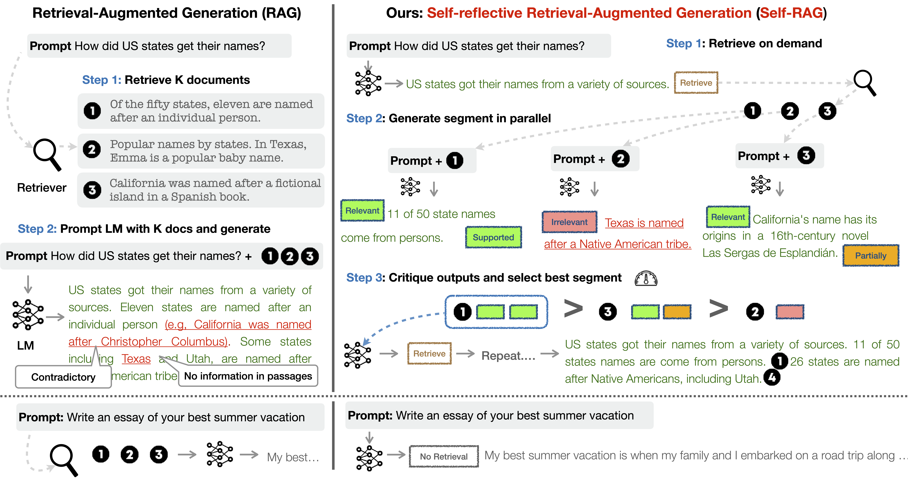
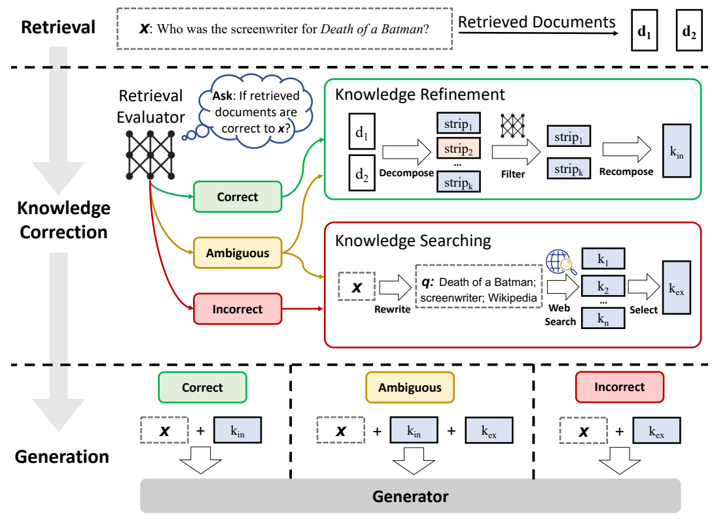

# Advanced-RAG

## Self-RAG: Learning to Retrieve, Generate and Critique through Self-reflection (2023)



- [Self-RAG: Learning to Retrieve, Generate and Critique through Self-reflection](https://arxiv.org/abs/2310.11511)

### Usage

```python
python Self-RAG/main.py --query "프랑키의 세계관 최종 목표는 뭔가요?"
```

```text

```

## CRAG : Corrective Retrieval Augmented Generation (2024)




- [Corrective Retrieval Augmented Generation](https://arxiv.org/abs/2401.15884)


### Usage
```python
python Corrective-RAG/main.py --query "프랑키의 세계관 최종 목표는 뭘까요?"
```

```text
프랑키의 세계관에서 최종 목표는 "세계 최고의 배를 만드는 것"입니다. 그는 이를 위해 끊임없이 노력하며, 해적단의 조선공으로서 세상을 일주하는 꿈을 가지고 있습니다. 이러한 목표는 그의 열정과 숭고한 꿈을 나타냅니다.
```